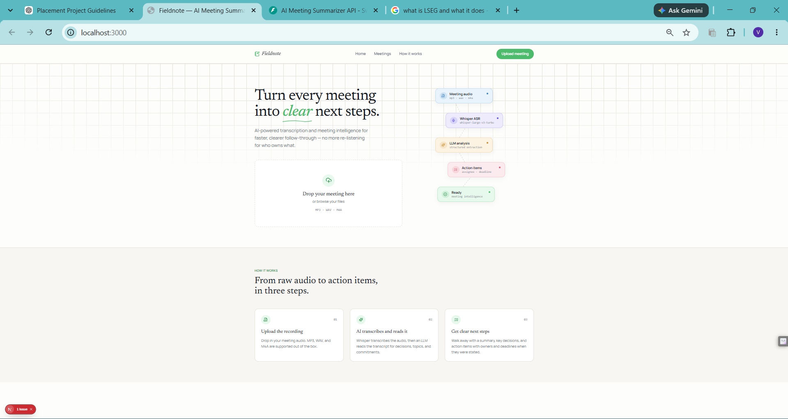
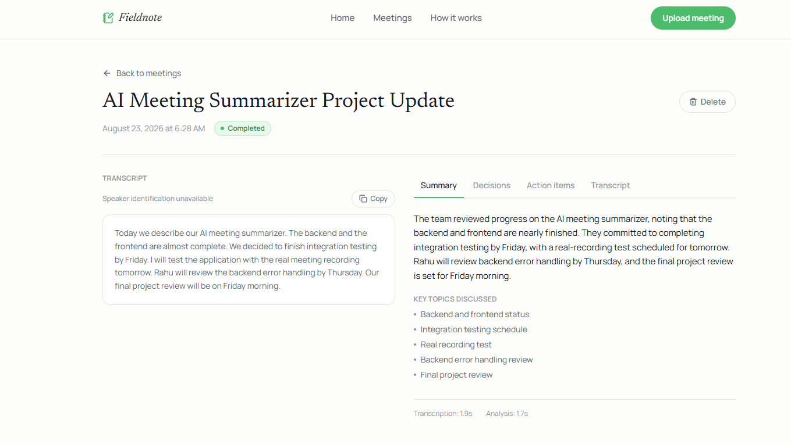

# Fieldnote — AI Meeting Summarizer

Turn a meeting recording into a transcript, an action-oriented summary,
key decisions, and a task list with owners and deadlines — automatically.

## Overview

**Problem:** meeting notes are inconsistent, action items get lost, and
nobody wants to re-listen to a 45-minute recording to remember who owns
what.

**Solution:** upload the audio. Fieldnote transcribes it with Groq's
Whisper API, then has an LLM read the transcript and extract a
structured summary — decisions, discussion topics, and action items with
assignees and deadlines *only when the transcript actually states them*.

**Workflow:**

```text
Audio upload → Whisper transcription → LLM analysis → Pydantic validation → stored + shown in the UI
```

## Features

- Drag-and-drop audio upload (MP3, WAV, M4A) with client + server-side validation
- Asynchronous processing with live status polling (pending → transcribing → analyzing → completed/failed)
- Full transcript display (honest about the lack of speaker diarization — it says so rather than inventing speaker labels)
- Executive summary, key discussion topics, decisions, and action items (task/assignee/deadline/priority)
- Two prompt versions (baseline vs. structured/anti-hallucination) for evaluating prompt effectiveness
- One automatic retry if the LLM's structured output fails validation
- Meeting dashboard and per-meeting workspace with tabbed insights
- 27 automated backend tests, all Groq calls mocked — no API key required to run them
- Runnable WER and prompt-comparison evaluation scripts

## Screenshots

### Fieldnote — Landing Page



### Fieldnote — Meetings Dashboard


### Fieldnote — Meeting Summary



### Fieldnote — Meeting Decisions


### Fieldnote — Meeting Action Items


### Fieldnote — API Documentation


## Architecture

See [`docs/architecture.md`](docs/architecture.md) for the full breakdown
and the reasoning behind each choice. Short version:

```text
Next.js Frontend  --REST-->  FastAPI Backend  --->  Groq (Whisper + LLM)
                                    |
                                    v
                                 SQLite
```

The frontend never talks to Groq directly — only the backend holds the
API key.

## Tech stack

- **Frontend:** Next.js (App Router), React, TypeScript, Tailwind CSS, Framer Motion, Lucide icons
- **Backend:** Python 3.11+, FastAPI, Uvicorn, Pydantic, SQLAlchemy, SQLite
- **AI:** Groq API — `whisper-large-v3-turbo` (ASR) and `openai/gpt-oss-20b` (LLM), both configurable via environment variables
- **Testing:** pytest, httpx

## Project structure

```text
meeting-summarizer/
├── backend/
│   ├── app/
│   │   ├── main.py                    FastAPI app entrypoint
│   │   ├── config.py                  environment-driven settings
│   │   ├── api/routes/                 upload/list/get/status/delete, health
│   │   ├── services/                   transcription, summarization, orchestration
│   │   ├── models/                     SQLAlchemy Meeting model
│   │   ├── schemas/                    Pydantic request/response/LLM-output schemas
│   │   ├── prompts/                    Prompt A (baseline) + Prompt B (production)
│   │   ├── database/                   engine/session setup
│   │   ├── core/                       centralized logging
│   │   └── utils/                      audio validation
│   ├── scripts/                        evaluate_wer.py, compare_prompts.py
│   ├── tests/                          27 tests, Groq fully mocked
│   ├── requirements.txt
│   └── .env.example
├── frontend/
│   ├── app/                            landing page, dashboard, meeting workspace
│   ├── components/                     UploadDropzone, ProcessingStages, etc.
│   ├── lib/api.ts                      typed API client + status polling
│   ├── types/meeting.ts
│   └── .env.example
├── sample_data/                        where you add your own audio + ground truth
├── docs/
│   ├── architecture.md
│   └── evaluation.md
├── .gitignore
├── LICENSE
└── README.md
```

## Requirements

- Python 3.11+
- Node.js 18.18+ (Next.js 15 requirement)
- A Groq API key — free tier available at [console.groq.com/keys](https://console.groq.com/keys)

## Backend setup

```bash
cd backend
python -m venv .venv
```

Activate the virtual environment:

```bash
# macOS / Linux
source .venv/bin/activate

# Windows PowerShell
.venv\Scripts\Activate.ps1
```

Install dependencies:

```bash
pip install -r requirements.txt
```

Create your environment file:

```bash
cp .env.example .env
```

Then open `backend/.env` and set:

```env
GROQ_API_KEY=your_key_here
```

Run the backend:

```bash
uvicorn app.main:app --reload
```

The API is now live at **http://localhost:8000** (interactive docs at
`http://localhost:8000/docs`).

## Frontend setup

In a second terminal:

```bash
cd frontend
npm install
cp .env.example .env.local
npm run dev
```

The app is now live at **http://localhost:3000**.

> If your backend is running on a different host/port, edit
> `NEXT_PUBLIC_API_URL` in `frontend/.env.local` accordingly. If you access
> the frontend via `127.0.0.1` instead of `localhost`, also add that origin
> to `CORS_ORIGINS` in `backend/.env` — browsers treat them as different
> origins.

## Environment variables

**`backend/.env`** (copy from `backend/.env.example`):

```env
GROQ_API_KEY=
ASR_MODEL=whisper-large-v3-turbo
LLM_MODEL=openai/gpt-oss-20b
DATABASE_URL=sqlite:///./meeting_summarizer.db
CORS_ORIGINS=http://localhost:3000,http://127.0.0.1:3000
MAX_UPLOAD_MB=25
```

**`frontend/.env.local`** (copy from `frontend/.env.example`):

```env
NEXT_PUBLIC_API_URL=http://localhost:8000
```

Never commit `.env` or `.env.local` — only the `.env.example` templates
are tracked in git.

## API endpoints

| Method | Path | Description |
|---|---|---|
| GET | `/health` | Liveness check |
| POST | `/api/meetings/upload` | Upload audio, returns `202` + `meeting_id`, starts background processing |
| GET | `/api/meetings` | List all meetings (summary view) |
| GET | `/api/meetings/{id}` | Full meeting record (transcript, summary, decisions, action items) |
| GET | `/api/meetings/{id}/status` | Lightweight status for polling |
| DELETE | `/api/meetings/{id}` | Delete a meeting |

Full interactive documentation is available at `/docs` while the backend
is running (FastAPI's built-in Swagger UI).

## AI pipeline

```text
Audio file
  → Groq Whisper (whisper-large-v3-turbo)
  → Transcript
  → Prompt B (structured, anti-hallucination instructions)
  → Groq LLM (openai/gpt-oss-20b)
  → Pydantic validation (MeetingAnalysis schema)
     → if invalid: one retry with a stricter follow-up instruction
     → if still invalid: meeting marked "failed" with a clear error
  → Stored in SQLite, surfaced in the UI
```

## Prompt engineering

Two prompt versions live in `backend/app/prompts/meeting_analysis.py`:

- **Prompt A** (baseline) — minimal instruction, no guardrails. Used only
  as an evaluation control; never called by the running app.
- **Prompt B** (production) — explicitly instructs the model to ground
  every field in the transcript, prefer `null` over invention, and
  distinguish agreed decisions from mere suggestions. This is what the
  app actually uses.

Run `backend/scripts/compare_prompts.py` to see both outputs side by side
on the same transcript. See [`docs/evaluation.md`](docs/evaluation.md)
for the full comparison methodology.

## Evaluation

Full methodology in [`docs/evaluation.md`](docs/evaluation.md), covering
transcription accuracy (WER), summary quality, action-item quality, and
prompt effectiveness. **No results are fabricated or pre-filled** — this
development environment had no microphone/TTS and no live API key, so
the evaluation scripts (`evaluate_wer.py`, `compare_prompts.py`) are
ready to run but haven't been run against real data yet. See
`sample_data/README.md` for how to add your own audio and generate real
measurements.

## Running tests

```bash
cd backend
source .venv/bin/activate   # if not already active
pytest tests/ -v
```

All 27 tests mock the Groq API — no `GROQ_API_KEY` or network access is
needed to run them.

## Limitations

- **Speaker diarization is not implemented.** The transcript UI honestly
  shows "Speaker identification unavailable" rather than inventing
  speaker labels.
- **No live-AI results have been verified in this build environment** —
  everything Groq-dependent (real transcription, real summarization) is
  implemented and unit-tested with mocks, but requires your own
  `GROQ_API_KEY` to exercise end-to-end. See the section below.
- Priority defaults to `"medium"` when the transcript contains no
  explicit urgency signal — this is a documented conservative default,
  not an inferred judgment.
- Status polling (2s interval) is simple and reliable at this scale but
  would not be the right choice for a system processing many concurrent
  long meetings — see `docs/architecture.md` for the reasoning.

## The one remaining manual step

Everything that can be verified without a live API key has been:
27 automated tests pass, the frontend builds cleanly, and every UI state
(processing, completed, failed, all four insight tabs) has been visually
verified — the completed/processing states were verified by mocking the
API response shape in the browser, since a keyless backend fails
instantly and can't reach those states on its own.

**What hasn't been tested — because it requires a real `GROQ_API_KEY`
that isn't available in this environment:**

1. Set `GROQ_API_KEY` in `backend/.env`.
2. Start both servers and upload a real short meeting recording (MP3/WAV/M4A).
3. Confirm it moves through transcribing → analyzing → completed with a
   real transcript and real extracted summary/decisions/action items.
4. Optionally run `scripts/evaluate_wer.py` and `scripts/compare_prompts.py`
   against your own sample audio/transcripts to fill in `docs/evaluation.md`
   with real measurements.

## Future improvements

- Speaker diarization (would require a diarization-capable model or a
  separate diarization step before/alongside Whisper)
- "Ask your meeting" — question-answering over a specific meeting's transcript
- Cross-meeting search
- An evaluation dashboard surfacing real WER/timing data once collected

## Demo video

_Add your demo video link here after recording it._

Suggested flow (2-4 minutes): landing page → upload a real meeting →
show the processing stages → transcript → summary → decisions → action
items → meeting dashboard → brief architecture explanation.
